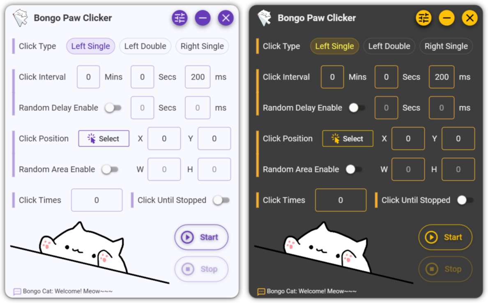

# BongoPawClicker


An auto clicker with bongo cat integrated

🔗[中文文档](./README/README-CN.md)
🔗[Download](https://github.com/Siriusq/BongoPawClicker/releases/download/v1.0/BongoPawClicker.exe)

# Preview


# Features
- Random click interval
- Random click area, the program will click at random positions within the area.
- Unlimited continuous clicks
- Light/Dark theme switching
- Automatically switch between English and Chinese according to the system language settings
- Modify your own hotkeys
- Bongo cats react differently depending on the click type (cat's paw on the table)
- Catcall alert when clicking done

# How to Use
- Hotkey self-definition: Click on the hotkey preview text box in the settings panel, press the keyboard to record new hotkeys, and then click the Set button to save the recording.
- Random click interval: Turn on the **Random Delay Enable** switch to type the delay time in the following text box, for example, if the click interval is set to **200** ms and the delay time is set to **100** ms, the final click interval will be randomly valued from **200-300** ms. In addition, the double-click interval will be randomly selected from **50-300** milliseconds after enabling the random delay.
- Click position： Either manually enter the screen coordinates in the text box or click the **Select** button to go to the position selector and press the left mouse button to select. After turning on the **Random Area Enable** switch, you can hold the left mouse button in the position selector to frame the range.

# Development
If you want to modify the program’s code, please open **FodyWeavers.xml** and comment out **Costura**, otherwise VS won't be able to display the window preview correctly. Because **Fody.Costura** is used in the project to package the program into a single exe, DLL and other files will be embedded in the exe when packaging, which will cause VS to report an error due to inability to find the required file.

For example, if the path to a required DLL is `. /bin/Release/xxx.dll`, Fody.Costura will embed this file in BongoPawClicker.exe, `. /The `xxx.dll` will not exist in the `bin/Release` directory, and VS will still look for the DLL according to the previous path, which leads to an error.


```xml
<?xml version="1.0" encoding="utf-8"?>
<Weavers xmlns:xsi="http://www.w3.org/2001/XMLSchema-instance" xsi:noNamespaceSchemaLocation="FodyWeavers.xsd">
  <!--<Costura />-->
</Weavers>
```

# Murmur
My motivation for developing this clicker is that the plot of a certain open-world game that starts with G is getting more and more naive and the scriptwriters are bringing in their crap, and I couldn't stand it. Yet there is no option to skip the plot, so I decided to create a mouse clicker to help me automatically click to play the episode quickly without the need for me to watch it myself, and I can also learn WPF along the way. As for the bongo cat, it's just for fun! 🐱🐱

# Package
### NuGet
- [Material Design In XAML](http://materialdesigninxaml.net/)
- [Costura](https://github.com/Fody/Costura) 
- [Resource.Embedder](https://www.nuget.org/packages/Resource.Embedder/)

### Special thanks
- [ChatGPT](https://chat.openai.com/)