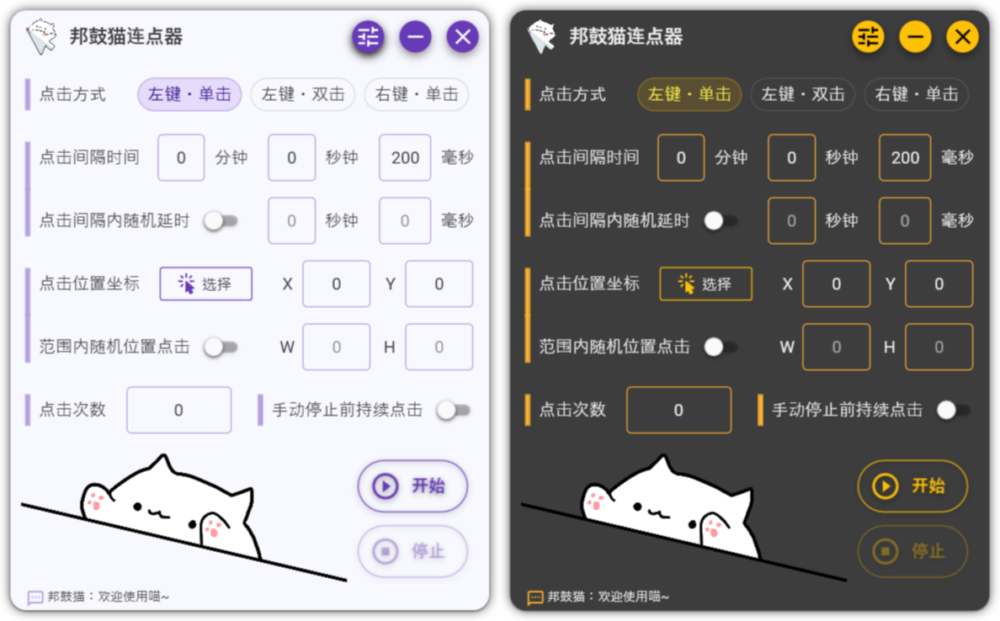

<h1 align="center">邦鼓猫连点器</h1>

<p align="center">
一个集成了邦鼓猫 (Bongo Cat) 的自动鼠标连点器
</p>

<p align="center">
    
  
  
  
</p>

<p align="center">
  <a href="https://github.com/Siriusq/BongoPawClicker">🔗 English README</a>
  <a href="https://github.com/Siriusq/BongoPawClicker/releases/download/v1.1/BongoPawClicker.exe">🔗 下载</a>
  <a href="https://siriusq.top/BongoPawClicker.html">🔗 开发总结</a>
</p>

# 🎬 预览


# ✨ 特性
- ⏱ 可设置随机点击间隔
- 🎯 可以设置点击范围，在范围内随机位置点击
- 🖱 支持实时跟随鼠标位置的自动点击
- 🔁 支持无限连续点击
- 🌗 浅色 / 深色主题切换
- 🌐 根据系统语言自动切换中英文
- ⌨️ 支持自定义快捷键
- 🐾 执行自动点击时，邦鼓猫会根据点击方式做出不同反应（猫爪拍桌.jpg）
- 🔔 可在点击完成后发出猫叫提醒

# 使用指南
## 📘 帮助
### ⌨️ 快捷键
- 默认快捷键：`Alt + Ctrl + P`
- 即使程序最小化，也可通过快捷键触发自动点击
- 点击执行过程中再次按下快捷键，可立即停止所有后续点击
### ⚙️ 快捷键自定义
- 在设置面板左键单击快捷键预览框
- 按下想要的键盘组合即可录制
- 点击“确定”保存
### 🖱 实时跟随鼠标位置点击
- 关闭 **范围内随机位置点击** 开关
- 清空点击位置的 **X** 和 **Y** 坐标
- 点击将实时跟随鼠标位置
### 🎯 点击位置选择
- **未开启范围内随机位置点击**：点击 Overlay 任意位置完成选择
- **开启范围内随机位置点击**：按住左键框选选择点击范围
### ⏳ 随机点击延时
- 开启 **点击间隔内随机延时**
- 输入延迟时间，例如点击间隔 200ms，延迟 100ms，最终间隔将在 200–300ms 随机
- 开启随机延时后，执行左键双击时双击间隔将在 50–300ms 随机

# ⚠️ 已知问题
- 🛡 **权限问题**：部分程序权限更高，如果连点器无法在这些窗口工作，请尝试以管理员身份运行
- ⏱ **点击间隔**：受定时器精度与电脑性能影响，实际点击间隔可能比设置的稍长

# 💻 开发
如果你想修改程序的代码，请打开 **FodyWeavers.xml**，注释掉 **Costura**，否则VS将不能正确的显示窗口预览。因为项目中使用了 **Fody.Costura** 来将程序打包为单个的 exe，打包时 dll 等文件会嵌入 exe 中，导致 VS 因找不到需要的文件而报错。

例如某个需要的 dll 路径为`./bin/Release/xxx.dll`，Fody.Costura 会将这个文件嵌入 BongoPawClicker.exe 中，`./bin/Release` 目录下将不会存在 `xxx.dll`，而VS仍然会按照先前的路径来寻找 dll，导致出错。

```xml
<?xml version="1.0" encoding="utf-8"?>
<Weavers xmlns:xsi="http://www.w3.org/2001/XMLSchema-instance" xsi:noNamespaceSchemaLocation="FodyWeavers.xsd">
  <!--<Costura />-->
</Weavers>
```

# 🐾 碎碎念
我开发这个连点器的动机是某款开放世界游戏的剧情越来越幼稚且编剧夹带私货，实在看不下去，却又不能跳过剧情，于是决定搞一个鼠标连点器来帮助我点点点播放剧情，顺带学习下WPF。至于邦鼓猫嘛，纯属找个乐子（😸欸嘿.jpg）

# 📦 软件包
### 🎲 NuGet
- [Material Design In XAML](http://materialdesigninxaml.net/)
- [Costura](https://github.com/Fody/Costura) 
- [Resource.Embedder](https://www.nuget.org/packages/Resource.Embedder/)

### 🙏 特别鸣谢
- [ChatGPT](https://chat.openai.com/)